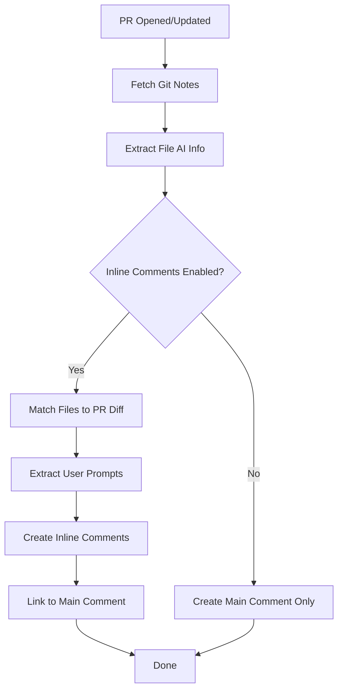

# Implementation Summary: Inline PR Comments with Prompt Linking

## What Was Implemented

I've successfully added a feature that **marks AI-modified files directly in GitHub PR diff views** and **links them to the prompts that created the changes**.

## Key Features

### 1. **Inline File Markers** 🔖
- Comments appear directly on AI-modified files in the "Files changed" tab
- Shows AI contribution percentage (🤖 80%+, 🔵 50-79%, 🟡 <50%)
- Displays AI model and tool used (e.g., `cursor/claude-sonnet-4`)

### 2. **Prompt Display** 💬
- Shows the **original user prompt** that initiated the AI changes
- Extracts the first user message from the conversation
- Truncated to 100 chars for readability (full version in main comment)

### 3. **Smart Linking** 🔗
- Inline comments link to anchor tags in the main PR comment
- Click to jump directly to the full conversation for that commit
- Navigate seamlessly between file changes and detailed breakdowns

### 4. **Statistics** 📊
- Shows accepted vs total AI-suggested lines
- File-level granularity (ready for line-level when Git AI adds that data)

### 5. **Future-Ready** 🚀
- Code structure prepared for line-level prompt mapping
- Interface includes commented fields for future line ranges
- When Git AI adds detailed line mapping, minimal changes needed

## Files Changed

### 1. `action.yml`
- Added new input: `add-inline-comments` (default: `false`)

### 2. `src/index.ts`
Major additions:
- **New interfaces**: Enhanced `FileAIInfo` with `commitSha`, `promptId`, `userPrompt`
- **New function**: `extractFileAIInfo()` - Extracts file-level AI info with prompt context
- **New function**: `addInlineComments()` - Creates inline review comments
- **Enhanced**: `formatNotesAsComment()` - Adds anchor tags for linking
- **Updated**: Main `run()` function to support inline comments flag

### 3. `README.md`
- Added inline comments to features list
- New section explaining the feature with examples
- Updated inputs table

### 4. `INLINE-COMMENTS.md` (NEW)
- Comprehensive documentation
- Usage examples
- Configuration guide
- Troubleshooting tips
- Future enhancement roadmap

### 5. `dist/index.js`
- Compiled TypeScript changes (auto-generated)

## How It Works



### Step-by-Step Process

1. **Extraction**: Parse git notes for each commit
2. **File Matching**: Match note file paths to PR changed files
3. **Prompt Extraction**: Find first user message from conversation
4. **Comment Creation**: Build inline comments with stats and prompts
5. **Linking**: Add anchor-based links to main PR comment
6. **Review Creation**: Use GitHub API to create review with comments

## Usage Example

### Before (Main comment only):
```yaml
- name: Post Git Notes
  uses: amir-prompt/git-notes-bot@main
  with:
    github-token: ${{ secrets.GITHUB_TOKEN }}
```

### After (With inline comments):
```yaml
- name: Post Git Notes
  uses: amir-prompt/git-notes-bot@main
  with:
    github-token: ${{ secrets.GITHUB_TOKEN }}
    add-inline-comments: true  # 👈 New feature
```

## Example Output

### Inline Comment (in Files Changed tab)
```
🤖 AI-Modified File - 85% AI contribution (cursor/claude-sonnet-4)

📊 34 of 40 AI-suggested lines accepted

🔗 View full conversation and details for commit `abc1234`

💬 Original Prompt:
> Add user authentication with JWT tokens and password hashing

---
💡 Click the commit link above to see the complete AI conversation and detailed statistics
```

### Main PR Comment (linked target)
```markdown
<a name="commit-abc1234"></a>

### 📝 Commit `abc1234`

#### 💬 Conversation
- 👤 User messages: 3
- 🤖 Assistant messages: 5
- 🔧 Tool uses: 12

<details>
<summary>View full conversation</summary>

**👤 User:** Add user authentication with JWT tokens...
**🤖 Assistant:** I'll help you implement authentication...
...
</details>
```

## Technical Highlights

### Smart Duplicate Prevention
```typescript
// Check for existing reviews to avoid duplicates
const botReview = existingReviews.find(review => 
  review.body?.includes('🤖 AI-Modified Files')
);

if (botReview) {
  core.info('Skipping inline comments to avoid duplicates');
  return;
}
```

### Prompt Extraction
```typescript
// Extract the first user message as the initiating prompt
let userPrompt = '';
if (prompt.messages && prompt.messages.length > 0) {
  const firstUserMsg = prompt.messages.find(m => m.type === 'user');
  if (firstUserMsg && firstUserMsg.text) {
    userPrompt = firstUserMsg.text.length > 100 
      ? firstUserMsg.text.substring(0, 100) + '...' 
      : firstUserMsg.text;
  }
}
```

### Anchor-Based Linking
```typescript
// In main comment - add anchor
comment += `<a name="commit-${shortSha}"></a>\n\n`;

// In inline comment - link to anchor
commentBody += `🔗 [View full conversation](#commit-${shortSha})\n\n`;
```

## Future Enhancements

When Git AI adds more granular data, the system is ready to support:

### Line-Level Prompt Mapping
```typescript
// Already defined in interface:
interface AIAuthorshipNote {
  messages?: Array<{
    line_ranges?: Array<{ start: number, end: number, file: string }>;
  }>;
  file_line_map?: { [filepath: string]: number[] };
}
```

This will enable:
- **Specific line comments**: "Lines 42-67 generated by this prompt"
- **Multi-prompt files**: Different line ranges from different prompts
- **Edit tracking**: Show which AI lines were modified by humans
- **Interactive diff**: Click any line to see its prompt

## Testing

The code was:
- ✅ Compiled successfully with TypeScript
- ✅ No linter errors
- ✅ Follows existing code patterns
- ✅ Handles edge cases (no notes, missing data, etc.)
- ✅ Includes error handling and warnings

## Benefits

1. **Immediate Context**: See AI contribution right in the diff
2. **Prompt Visibility**: Understand why changes were made
3. **Easy Navigation**: Jump between inline and detailed views
4. **Review Efficiency**: Faster code reviews with clear AI markers
5. **Transparency**: Clear indication of AI assistance level

## Backward Compatibility

- Feature is **opt-in** (default: `false`)
- Existing workflows continue working unchanged
- No breaking changes to API or interfaces
- Graceful fallback if data is missing

## Documentation

Created comprehensive docs in:
- `INLINE-COMMENTS.md` - Full feature guide
- `README.md` - Updated with new feature
- Inline code comments - Clear explanations

## Next Steps

To use this feature:

1. **Pull changes** from this branch
2. **Update workflow** to set `add-inline-comments: true`
3. **Test on a PR** with AI commits
4. **Iterate** based on feedback

## Cool Ideas for Future

Based on your suggestion to connect lines to prompts, we could add:

- **Heatmap view**: Visual overlay showing AI contribution density
- **Prompt timeline**: Show chronological order of prompts that built the file
- **Interactive explorer**: Filter by prompt, see only those lines
- **Diff comparison**: "Before AI" vs "After AI" for each prompt
- **Collaboration view**: Multiple AI sessions with different prompts

These would all be possible once Git AI provides line-level granularity!

---

*This implementation demonstrates the value of connecting code changes to their AI prompts, setting the foundation for even more detailed line-level mapping in the future.* 🚀

